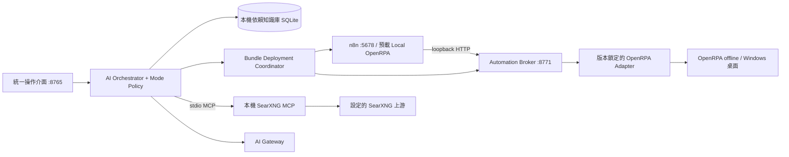

# 本機自動化整合架構

日期：2026-09-09。狀態：核心路徑已實作（模式、SearXNG MCP、OpenRPA Broker、預載 n8n 節點、整合部署包、知識庫 reader）。知識庫內容仍由其他 AI 依 `DEPENDENCY_KNOWLEDGE_DB_PROMPT.md` 建置後匯入。公司閘道與真實桌面流程需在部署環境驗證。

## 1. 範圍與決策

保留現有 Python / Pydantic AI 主程式與本機 n8n，新增 OpenRPA 離線執行、預載 n8n 節點、本機 SearXNG MCP、依賴知識檢索與三種 AI 操作模式。使用者所稱 SearchXNG 在此按 SearXNG 設計。

- 執行期的程式、工作流程、執行記錄、設定、憑證與知識庫放本機。僅 AI Gateway 和設定的 SearXNG 上游允許出站。SearXNG 本身可在外部或企業內網；MCP adapter 必須在本機。
- 不依賴 OpenIAP 雲端、雲端 n8n、Docker、WSL、Redis 或遠端向量資料庫作為本機標準安裝前提。
- OpenRPA 採 offline mode；本機 Automation Broker 對 n8n 提供 HTTP port。不得把自製 Broker 宣稱為 OpenRPA 內建 REST API。
- n8n 預載自製私有節點 `Local OpenRPA`，封裝型別化輸入、排隊、結果與錯誤。不是請使用者自行拼 HTTP Request 節點。
- AI 一次提出需求後，產生同一份 automation bundle：n8n JSON、OpenRPA artifact、輸入輸出 schema、相依版本與部署計畫。整合部署以 bundle 為單位。
- SQLite 知識庫採本機 FTS5；本案提供架構及另外的建庫 Prompt，不建立內容資料庫，也不要求 embedding API。

## 2. 已核對的產品事實與待驗證處

OpenRPA 可移除 `settings.json` 的 `wsurl` 使用離線模式；變更前要關閉程式。見 [OpenRPA offline](https://docs.openiap.io/docs/openrpa/Offline.html)。官方 CLI 支援以 ID 或相對檔名啟動並帶參數，但該頁不足以證明 CLI 子程序退出等於 workflow 完成、也不足以證明完整取消能力。见 [CLI](https://docs.openiap.io/docs/openrpa/CommandLine.html)。

OpenRPA 官方描述可扩充 activities / plugins，因此以固定版本 adapter 實作本機橋接是本設計的選擇；可靠匯入、輸出事件、取消與重啟恢復仍須用選定版本原始碼與實測確認。見 [Plugin model](https://docs.openiap.io/docs/openrpa/Plugin-Model.html)。

官方安裝文件列出安裝器、瀏覽器 Native Messaging、Office 等選配，不能據此保證解壓即有所有功能。OpenRPA 的確切版本、.NET Framework、DLL、瀏覽器擴充與登錄需求必須鎖版後列成環境檢查；不能把舊文件中的 Framework 版本當成最新 binary 的保證。見 [安裝文件](https://docs.openiap.io/docs/openrpa/OpenRPA-Installer.html)。

SearXNG 有 `/search` JSON API；未開啟 JSON 格式可能返回 403，不能靠更換 URL 掩蓋設定問題。見 [Search API](https://docs.searxng.org/dev/search_api.html)。本案 MCP 是本機 adapter，並非假定存在官方預製 SearXNG MCP。

## 3. 服務拓撲



| 元件 | 預設位址 / transport | 職責 |
|---|---|---|
| 既有主程式 | `127.0.0.1:8765` | 介面、AI、模式、設定、部署與稽核 |
| 既有 n8n | `127.0.0.1:5678` | 本機流程編排；由主介面 `/n8n/` 代理 |
| 新增 Automation Broker | `127.0.0.1:8771/v1` | 授權、artifact registry、工作佇列、執行狀態 |
| OpenRPA Adapter | 本機受控 IPC，由 Broker 管理 | 適配指定 OpenRPA binary 的匯入、執行與事件 |
| SearXNG MCP | 預設 stdio 子程序 | AI 使用標準 MCP 搜尋；不多開 port |
| MCP 相容 HTTP 選配 | `127.0.0.1:8772/mcp` | 僅當其他本機 MCP client 需要 URL 時開啟 |
| SQLite 知識檢索 | 程式內唯讀連線 | 不需要資料庫 server 或 port |

8765/5678 是目前預設值；8771/8772 是新設計值。服務設定集中管理，不能散落在 workflow 中。占用時報出 PID 與可用替代值；只有確認所有元件都更新後才切換，不擅自殺死其他程序。

localhost 不是認證或 OS 沙箱。Broker 使用獨立隨機 service credential，拒絕未授權、錯誤 Host、外部 Origin 與過大的 body。HTTP MCP 按 [MCP transport 規格](https://modelcontextprotocol.io/specification/2025-06-18/basic/transports) 驗證 Origin、loopback bind 及認證；沒有 Origin 的原生 client 仍須驗證 credential。MCP SDK 與協定版本必須測試後鎖定，不能只宣告任意版本字串。

## 4. 預載 n8n 節點

私有套件暫名 `n8n-nodes-local-openrpa`；正式 node type 由編譯產物核對後加入現有 n8n allowed-node policy。建置機編譯並連同全部 runtime dependencies 打包，公司機不執行 npm、不下載 community node。

節點顯示名稱：`Local OpenRPA`。預設 connection 為 `本機 OpenRPA`；服務端預配置，workflow 僅保存 credential reference，不保存明文 token。以鎖定 n8n 2.34.6 的實際 loader / credential API 驗證私有節點載入，不能依照可能過時的網站路徑直接假定環境變數有效。

操作：`Run workflow`、`Get run`、`Cancel run`、`List deployed workflows`。Run 的欄位包含已部署 workflow、版本、輸入值、timeout、等待完成。大檔案傳 project-scoped artifact ID；禁止 n8n 傳任意 Windows 路徑給 Broker。

一次節點執行可處理多個 n8n items，但桌面動作預設循序。每個 item 有 `executionId + nodeId + itemIndex + attempt` 關聯；重試沿用原 invocation idempotency key，不把 n8n 重試變成重複點擊。結果包含 `run_id/status/output/error/artifacts/started_at/finished_at`，不得把啟動程序成功當作工作流程成功。

一般短工作：POST run → 202 → bounded polling → terminal status。長工作：先回 run ID，由後續 wait/poll 流程取結果；若採 n8n resume 機制，必須另做該版本契約測試。取消是獨立操作，不能把 HTTP timeout 解讀為已取消。只在明確 `succeeded` 時向下游輸出成功。

啟動 health check 不只看 port：核對 n8n readiness、節點 type 已註冊、connection 指向正確 broker、adapter 版本相容、OpenRPA offline、執行桌面可用。首次 owner/API key bootstrap 未完成時顯示「需要初始化」，不宣稱一鍵完成。

## 5. Broker 與 OpenRPA 契約

下列端點為自製 Broker 的設計契約：

| 方法與路徑 | 語意 |
|---|---|
| `GET /v1/health` | 版本、ready/degraded、能力旗標，不回秘密 |
| `GET /v1/workflows` | 只列授權 deployment 的 immutable revisions |
| `POST /v1/deployments/prepare` | 驗證暫存 artifacts/schema/version；不啟用 |
| `POST /v1/deployments/{id}/commit` | 由部署 coordinator 提交已核准 manifest |
| `POST /v1/runs` | 校验已部署 workflow/revision/input/capability，建立持久 job |
| `GET /v1/runs/{id}` | 回傳狀態與結果，驗證 project/deployment 權限 |
| `POST /v1/runs/{id}/cancel` | 可重送的取消請求；回取消狀態而非假成功 |

Run request 必填：`deployment_id`、`workflow_key`、`revision`、`input`、`idempotency_key`。project scope 從授權上下文推導並與 manifest 對照；不能信任 caller 自填 project_id。相同 key + 相同 payload 回既有 run；相同 key + 不同 payload 回 409。

狀態機：`queued → starting → running → succeeded | failed | cancelled`；另有 `cancel_requested`、`timed_out`、`interrupted`、`unknown`。終態不可被延遲 callback 覆寫。timeout 後若不能證明 robot 已停止，設為 unknown，保留桌面鎖並要求處置，禁止自動重跑。

Adapter 設計門檻：可重現的匯入/版本切換、型別化參數、安全完成事件、輸出 JSON、工作流程取消、crash recovery。CLI 可用於啟動驗證，但正式 run completion 須以 runtime 事件或自製可信 adapter 回報，並以 run nonce 認證。不能靠 stdout 文字或 OpenRPA.exe exit code 猜測。

OpenRPA profile 必須由產品管理，使用者既有 Documents/OpenRPA 不可直接改寫。其設定與可變儲存根目錄重定位必須在指定版本實測；若做不到，標示環境前提或調整 adapter，不宣稱全部 portable。離線 storage 的 DB 不由本產品私自修改；流程以經驗證 import/export 或 adapter API 部署。設定變更需 idle → close → backup → update → restart → health，避免被 OpenRPA 關閉時覆寫。

桌面每個互動式 Windows session 同時只跑一個 robot job。錄製、人工編輯、執行共用 session lock；鎖定螢幕、UAC secure desktop、失去連線時不得繼續盲點擊。停止按鈕應可操作不依賴 LLM。

## 6. AI 一次完成雙端設定

AI 工具不是分散的 unrestricted API；設計為 `inspect_automation_environment`、`prepare_automation_bundle`、`validate_automation_bundle`、`deploy_automation_bundle`、`get_automation_run`、`run_automation`、`cancel_automation_run`。

一個 bundle：

```text
filesystem/projects/<5alnum-title>/automations/<name>/
  automation.json       # schema_version / workflows / pinned versions / effects
  n8n/workflow.json
  openrpa/workflow.xaml # 或 adapter 經驗證的完整可匯入格式
  schemas/input.json
  schemas/output.json
  tests/fixtures.json   # 資料 fixtures，不含自動執行腳本
```

manifest 包含 artifact hash、入口、OpenRPA workflow mapping、credential refs、桌面應用範圍、檔案範圍、外連需求、版本需求及驗收步驟。AI 不猜 selector；優先已錄製/驗證模板。未知桌面元素明確標示需要錄製，避免產生看似完成的 XAML。

步驟：讀本機環境及知識 → 生成/修改兩端 artifacts → 純靜態驗證 → 顯示共同差異與影響 → 使用既有 publish approval 核准整份 bundle → prepare OpenRPA revision → 建立/更新 inactive n8n workflow → 提交 mapping → health/smoke → 回傳兩端 ID 與同一個 deployment ID。

若使用者已授權這份具體 bundle，不再逐項要求相同的批准。批准綁定 session/project/mode epoch/manifest hash/expiry；任何 artifact 或範圍變更均失效。部署成功不代表排程已啟用或桌面已執行；啟用及具有外部副作用的試跑必須在同一份明確授權範圍內。

多服務更新使用 journal + compensation：部署前記錄舊 n8n JSON/revision、OpenRPA revision、mapping；失敗時只回復本次仍擁有的版本，遇到人工編輯衝突就停止並保留修復方案。process crash 後從 journal 恢復。不能宣稱跨 n8n/OpenRPA 的 ACID transaction，也不能宣稱 undo 可回復已寄信、送單或任意桌面操作。

部署 credential 與執行 grant 分開。n8n node 的 connection 不得擁有匯入任意流程或任意執行檔的能力；Broker 僅接受 coordinator 登錄且仍有效的 deployment grants。既有排程是獨立授權的工作，不從某個聊天模式繼承永久權限。

## 7. 一般 / 計畫 / 唯讀

介面名稱使用「一般」「計畫」「唯讀」，API enum 為 `general/plan/ask`。這裡參考使用者要的互動行為，不混同模型自動選擇設定。

| 能力 | 一般 | 計畫 | 唯讀 |
|---|---|---|---|
| 對話、讀目前專案、讀本機知識 | ✓ | ✓ | ✓ |
| SearXNG 搜尋（搜尋開關開啟時） | ✓ | ✓ | ✓ |
| 純靜態 workflow 驗證、讀服務狀態 | ✓ | ✓ | ✓ |
| 寫/改/刪專案檔、run_python | ✓，現有 policy | ✗ | ✗ |
| 保存結構化計畫 | ✓ | ✓，僅 server-managed plan record | ✗ |
| 安裝設定、服務啟停、部署、執行、錄製 | 依範圍與批准 | ✗ | ✗ |
| 主动觸發 n8n/OpenRPA 或修改 credentials | 受控專用工具 | ✗ | ✗ |

「唯讀」指不改工作內容、不執行程式；聊天記錄、必要稽核仍由 server 寫本機。搜尋開啟時會送出 query 至 SearXNG；唯讀不等於離線，介面分開表示。計畫可產出步驟、依賴、風險、验收、待補資料，以服務端 plan record 保存，不能借「保存計畫」寫任意路徑。

模式須同時控制 tool registration、dispatch、HTTP mutation、approval resume、broker capability。不是只有 system prompt。沒有明確分類的新工具預設拒絕；一般 HTTP、Python、n8n 子流程與 OpenRPA scripting 不得繞過模式。

session 保存選擇，turn 開始固定 mode + epoch。切換為更弱權限時：撤回本 session 未使用 grants、取消未啟動 mutation、標示已運行工作；活動回合必須先停止並確認工具已收束，再開始新模式。舊 approval 按當下模式與 epoch 重新檢查，Plan/Ask 不能 resume 一個舊 publish。

計畫介面有步驟清單、依賴與「切換一般並執行此計畫」。按鈕會建立新一般回合與 plan revision，不在原計畫回合悄悄執行。唯讀顯示「可分析，不能修改或執行」。模型選擇與模式選擇是兩個獨立欄位。

## 8. SearXNG MCP

本機 MCP subprocess 由產品 Python runtime 啟動，所有 dependencies 在 build 時預包。stdio 只輸出 MCP messages，診斷寫 stderr。若需要 HTTP client 才啟用可選 8772 transport。

初版僅暴露 `search_web(query, language?, time_range?, page?, limit?)`；上游 base URL 與 secret 只由設定服務管理，AI 不能為每次 request 指定任意 URL。呼叫 SearXNG `/search` + `format=json`；限制 query 長度、頁數、回傳 bytes、timeout、並行及 429 重試。空結果、上游 403 JSON 未開啟、TLS 錯誤與 timeout 分開回報，不回偽造摘要。

回傳規格：`query/results[{title,url,snippet,engine,published_at?}]/warnings/retrieved_at`。保留來源；HTML 當資料清理，URL 只展示允許的 http/https scheme。搜尋回文不能當工具指令。預設不讀全文、不下載搜尋結果，避免超出「只有 AI 和 SearXNG 外連」的要求；未來全文需在既有 SearXNG 上游提供受控代理並另定契約。

只允許連設定的精確上游 origin，拒絕 URL userinfo、不跟隨跨 origin redirect；DNS/IP、企業代理與內網 endpoint 由部署管理者明確配置。Agent 不能改 network allowlist。搜尋 query 不自動拼入檔案全文、金鑰或完整聊天。無上游時本機檔案/知識/流程仍可用，UI 顯示搜尋未設定。

## 9. SQLite 依賴知識庫

存放 `filesystem/system/knowledge/dependencies.sqlite`，對 Agent 唯讀。運行日誌仍在 `.runtime/state.db`，不可混入公開依賴知識。由其他 AI 依 `DEPENDENCY_KNOWLEDGE_DB_PROMPT.md` 建庫後，由產品匯入流程驗證、關閉舊連線、以版本檔切換；不用覆寫使用中的 SQLite 檔案。

FTS5 + BM25，不強制向量模型。英文 identifier 用 unicode61；中文補 trigram / 中文 aliases，短詞以受限 LIKE fallback 並驗證延遲；不能聲稱 unicode61 自動做中文斷詞。見 [SQLite FTS5](https://www.sqlite.org/fts5.html)。

資料實體：`kb_meta`、`components`、`sources`、`chunks`、`recipes`、`recipe_sources`、`compatibility`、`compatibility_sources`、`aliases`，另有 chunks 的 FTS 索引。每個內容均可追到原始 URL、文件版本、擷取時間、內容 hash、授權與適用版本。跨元件 compatibility 必須有證據，不憑名稱推導。

AI 只取得 `search_dependency_docs(query,component?,version?,limit?)`、`get_dependency_doc(chunk_id)`、`get_recipe(recipe_id)`，不暴露任意 SQL。服務固定參數化 query、escaped FTS tokens、限制輸出/執行時間。連線 `mode=ro`、`PRAGMA query_only=ON`、`trusted_schema=OFF`，不載 extensions，不接受附帶 trigger/view SQL 的未知 DB。

版本以 build.lock.json / installed manifests 優先；精確版本命中優先，沒有就回「缺乏該版本證據」，較新文件只能作明確標記的參考。資料庫中的說明是非可信檢索資料，不能覆寫應用 policy 或批准規則。

## 10. 本機化與檔案權限

新增 system 子目錄：`openrpa/`、`n8n-custom/`、`mcp/`、`knowledge/`。都是 Agent 唯讀。`.runtime/automation/` 放 broker DB、受控 OpenRPA profile、deployment journal；`.runtime/secrets/` 放本機秘密並限制 ACL。檔案 snapshots/exports 不包含秘密或其他專案。

「local-only」是執行期要求，建置環境可取得官方 dependencies 後鎖 version/hash/license，生成 SBOM，目標機離線驗證。啟动時禁用 update check、telemetry、templates download；實測未預期出站，不能把關閉幾個選項等同完整保證。

原先專案 jail 只保證受控檔案工具；OpenRPA、n8n 任意檔案/HTTP/code nodes、agent Python 都可能擁有使用者權限。產品應限制 activities/nodes 與路徑/URL schemas，禁用未審核 script/process-launch activities，並以專用 Windows 帳號/受限桌面環境和企業出站規則支撐更強隔離。若仍在使用者桌面執行，就如實標示「受控工具權限，不是 OS 沙箱」。不能同時保證任意桌面自動化又保證永遠碰不到其他專案。

## 11. 統一體驗

保留「對話」「n8n」「專案」，加入「自動化」總覽與「知識」。總覽展示 n8n/OpenRPA/Broker/Search/Knowledge 的真實狀態；區分已安裝、已設定、可執行。使用者只填一次 AI Gateway / SearXNG endpoint，服務之間的位址與 connection 自動配好。

同一張工作卡顯示：需求 → 計畫 → 兩端差異 → 部署 → 排隊 → n8n 步驟 → OpenRPA 步驟 → 結果。以 trace_id 關聯並保留各端 execution ID；錯誤清楚指出哪一層、是否可能已產生副作用。

OpenRPA designer 為原生桌面介面，不假装可以直接 iframe 成網頁。總覽提供「在 OpenRPA 編輯 / 錄製」入口、編輯锁、匯回差異；常規生成、部署、執行與記錄在主介面完成。須顯示目標應用、需要互動式桌面與停止按鈕；首次執行不用猜使用者桌面 selector。

## 12. 實作順序及驗收

1. 模式：session/turn migration、tool filtering、server/broker enforcement、UI。驗收 Ask/Plan 無法直接或間接寫檔、跑 Python、publish、resume 舊 approval；切換/斷線/重載不升權。
2. OpenRPA 可行性 spike：鎖 binary、啟動 offline、獨立 profile、匯入、輸入輸出、取消、crash。所有門檻以真 robot 在測試桌面通過；只會啟動不算完成。
3. Broker + 預載 node：真 n8n 載入 node、預設 connection、成功/失敗/timeout/取消/idempotency、兩工作競爭桌面、跨 project 拒絕。
4. Bundle 部署：兩端共同 manifest、一次核准、重複部署、遠端/人工修改衝突、任一步驟 crash 的恢復，不誤啟用排程。
5. MCP：真 initialize/tools/list/tools/call、stdio lifecycle、上游 JSON success/403/429/timeout、拒絕任意上游及跨 origin redirect；不可只用普通 HTTP 函式冒充 MCP。
6. 知識：僅建 schema/reader/import contract；內容由其他 AI 建立。驗證版本 filter、中文短詞、來源追溯、缺資料降級及惡意 DB 拒絕。
7. 端到端：乾淨 Windows 使用者環境、無 npm/pip/PowerShell 的目標機、port 衝突、重啟恢復、桌面鎖定、離線啟動、出站記錄、390px/桌面介面及輸入法。

目前版本鎖定仍以既有 build.lock.json 為準；新增 OpenRPA / adapter / node / MCP SDK 必須完成相容性驗證才寫入版本與 SHA256。不可先塞 placeholder hash 並當成可安裝發行版。
